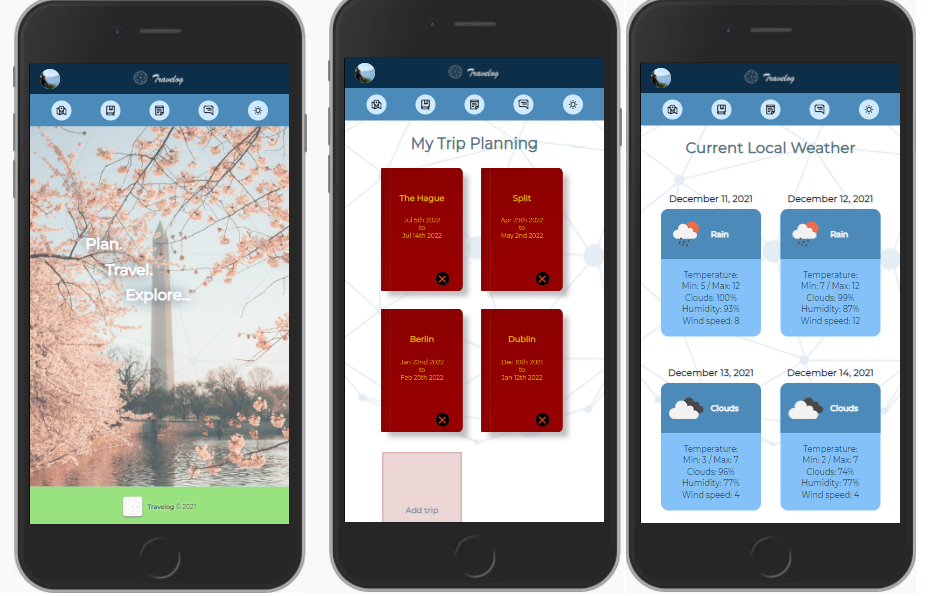
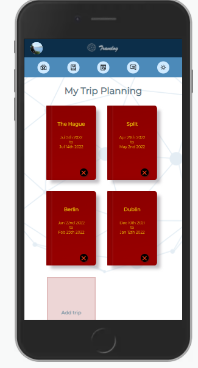
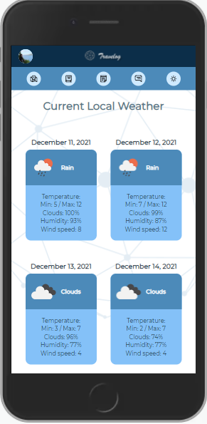

# Travelog

Travelog is a React application  for all travelers around the world. 

This application helps the user to plan, organize and enjoy, before and while traveling. It Gives you the opportunity to share your experience with other users, to discover new and exciting places by viewing other user's stories and collecting their experience by  directly communicating with them.

# Getting Started

## 1. Clone the Repo

https://github.com/djr319/effective-funicular.git

## 2. Install dependencies
\
 Navigate into the `./client` folder and run `npm install`
\
 Navigate into the `./server` folder and run `npm install`
 
 ## 3. Add Enviromental Variables
\
 Within the folder there is an `example.env` file. Copy the variables from that file, paste them on a new `.env` file that you will create locally and fill the variables with your local corresponding values.
\
 Do the same for the `./server` folder.

## 4. Start the app
\
 Run the client by executing `npm start` from inside the client folder.
Run the server by executing `nodemon` from inside the server folder.
To run front & backend: `npm run dev`.

# Tech stack

## Front-end

<a href="https://reactjs.org/">React</a>
\
<a href="https://firebase.google.com/">Firebase</a>
\
<a href="https://react-query.tanstack.com/">React Query</a>
\
<a href="https://react-query.tanstack.com/">TypeScript</a>
\
<a href="https://lesscss.org/">Less</a>

## Back End

<a href="https://expressjs.com/">Express</a>
\
<a href="https://nodejs.org/">Node JS</a>
\
<a href="https://www.prisma.io/">Prisma</a>
\
<a href="https://www.postgresql.org/">PostgreSQL</a>
\
<a href="https://www.postgresql.org/">Socket.io</a>
